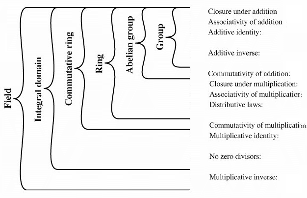

# Abstract Algebra

<figure><figcaption></figcaption></figure>

<figure><figcaption></figcaption></figure>

> Note that the x commutative group is rarely found, so the multiplicative Abelian group is not included.

> Written by [Ashley Jeong](https://app.gitbook.com/u/PNJ4Qqiz7kSxSs58UIaauk95AO43 "mention") of Fractalyze
