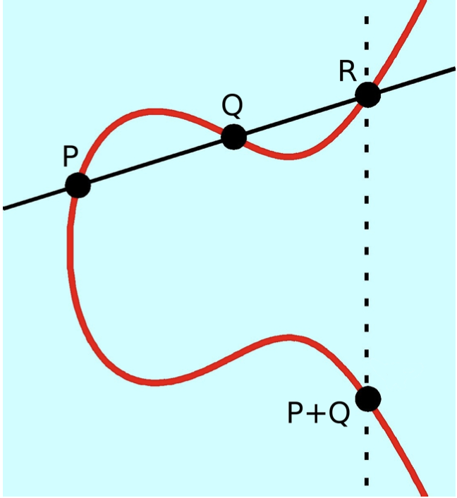

# Elliptic Curve

## Definition

An elliptic curve is defined by the following equation:

$$
y^2 = x^3 + ax + b
$$

Specifically, this form is named the "Short Weierstrass Form." With this form, a unique elliptic curve is defined by the given values of $$a$$ and $$b$$.

The set of points on an elliptical curve create an [additive abelian group](../group/#properties).

Note that $$\mathcal{O} = (0,1,0)$$  refers to the point at infinity (also known as the **"identity point"**) defined in [projective form](coordinate-forms.md#projective).

## Point Additions

We define point addition on an elliptic curve through asserting $$P + Q + R = 0$$, where points $$P$$, $$Q$$, and $$R$$ intersect on the elliptic curve in a straight line. Therefore, we find that $$P + Q = -R$$.

> Note: The negation of $$R=(x,y)$$ is $$-R = (x,-y)$$

<figure><figcaption></figcaption></figure>

### **Calculating Point Additions**

If $$P = (x_P, y_P)$$, $$Q=(x_Q,y_Q)$$, and $$-R = (x_R,y_R)$$:

#### **Case 1. Adding** $$P + Q = (x_P,y_P) + (x_Q,y_Q) = (x_R,y_R) = -R$$

$$
m = \frac{y_Q-y_P}{x_Q-x_P} \\
x_R = m^2 - x_P - x_Q \\
y_R = m(x_P - x_R) - y_P
$$

#### **Case 2. Doubling** $$2P = 2(x_P,y_P)= (x_P,y_P) + (x_P,y_P) =(x_R,y_R) = -R$$

$$
m = \frac{3x_P^2 + a}{2y_P}\\
x_R = m^2 - 2x_P \\
y_R = m(x_P-x_R) - y_P
$$

## **Confirming Additive Abelian Group**

* Closure: If $$P$$ and $$Q$$ are on the curve, $$P + Q$$ are on the curve :white\_check\_mark:
* Associativity: $$P+(Q+R)$$ = $$(P+Q)+R$$ :white\_check\_mark:
* Identity: $$P +\mathcal{O} = P$$ :white\_check\_mark:
* Inverse: $$P + -P = \mathcal{O}$$ :white\_check\_mark:
* Commutative: $$P+Q$$ = $$Q+P$$ :white\_check\_mark:

## References

* [Elliptic curves: A gentle Intro](https://andrea.corbellini.name/2015/05/17/elliptic-curve-cryptography-a-gentle-introduction/)&#x20;
* [A (Relatively Easy To Understand) Primer on Elliptic Curve Cryptography](https://blog.cloudflare.com/a-relatively-easy-to-understand-primer-on-elliptic-curve-cryptography/)

> Written by [Ashley Jeong](https://app.gitbook.com/u/Z4DJjtMFfLVXwMaSBRDBJRWVDV12 "mention") of A41
