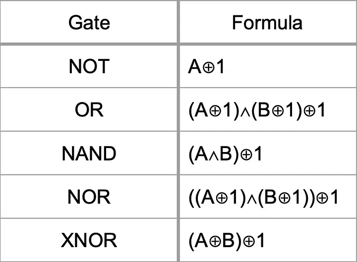

# Fast Elliptic Curve Arithmetic and Improved WEIL Pairing Evaluation

This explains [https://arxiv.org/abs/math/0208038](https://arxiv.org/abs/math/0208038).

## Motivation

Compute $$2P + Q$$ without the intermediate results $$2P$$ and $$P + Q$$ given $$E: y^2 = x^3 + a \cdot x + b$$, where $$4a^3 + 27b^2 \ne 0$$,

* $$2P$$: 1 multiplication, 2 squarings and 1 division. If $$P = (x_1, y_1)$$, $$R = 2P = (x_2, y_2)$$ is computed as follows:

$$
\lambda = \frac{3 {x_1}^2 + a}{2 y_1}
\\x_2 = \lambda^2 - 2x_1 \\
y_2 = (x_1 - x_2) \lambda - y_1
$$

* $$P + Q$$: 1 multiplication, 1 squaring and 1 division. If $$P = (x_1, y_1)$$ and $$Q = (x_2, y_2)$$, $$R = P + Q = (x_3, y_3)$$ is computed as follows:

$$
\lambda_1 = (y_2 - y_1) / (x_2 - x_1),\\
x_3 = {\lambda_1}^2 - x_1 -x_2,    \\ 
y_3 = (x_1 - x_3)\lambda_1 - y_1
$$

* Naive $$2P + Q$$: 2 multiplications, 3 squarings and 2 divisions&#x20;

How can we improve this?

## **Algorithm**

Suppose $$P = (x_1, y_1)$$ and $$Q = (x_2, y_2)$$ are distinct points on $$E$$, with $$x_1 \ne x_2$$. The sum $$P + Q$$ has coordinates $$(x_3, y_3)$$, where:

$$
\lambda_1 = (y_2 - y_1) / (x_2 - x_1),\\ x_3 = {\lambda_1}^2 - x_1 -x_2, \\ y_3 = (x_1 - x_3)\lambda_1 - y_1
$$

Now suppose we want to add $$(P + Q)$$ to $$P$$. To do this, we add $$(x_1, y_1)$$ to $$(x_3, y_3)$$ using the same addition rule. Assuming $$x_3 \ne x_1$$, the resulting coordinates are $$(x_4, y_4)$$, where

$$
\lambda_2 = (y_3 - y_1) / (x_ 3 - x_1), \\ x_4 = {\lambda_2}^2 - x_1 - x_3, \\ y_4 = (x_1 - x_4)\lambda_2 - y_1
$$

We can omit the explicit computation of $$y_3$$ since it is used only to calculate $$\lambda_2$$. Instead, $$\lambda_2$$ can be computed directly as:

$$
\begin{align*} 
\lambda_2 &= (y_3 - y_1) / (x_3 - x_1)\\
 &= ((x_1 - x_3) \lambda_1 - 2y_1) / (x_3 - x_1) \\
 &= -\lambda_1 - 2y_1 / (x_3 - x_1) \\
 \end{align*}
$$

Which means you can compute $$\lambda_2$$ using $$x_1, y_1$$ and $$\lambda_1$$.

$$
\lambda_2 = -\lambda_1 - 2y_1 / ({\lambda_1}^2 -x_2 - 2x_1)
$$

Additionally, you can compute $$x_4$$ using $$x_2, \lambda_1$$ and $$\lambda_2$$.

$$
\begin{align*} x_3 &= {\lambda_1}^2 - x_1 - x_2 \\
x_3 - x_4 &= {\lambda_1}^2 - x_1 - x_2 -( {\lambda_2}^2 - x_1 - x_3 ) \\ -x_4 &={\lambda_1}^2 - x_2 - \lambda_2^2 \\ x_4 &= x_2 + {\lambda_2}^2 - {\lambda_1}^2 \end{align*}
$$

This trick can also be applied when computing $$3P$$. Thus, $$3P + Q = ((P + Q) + P) + P$$ saves 2 multiplicaitons.

<figure><figcaption></figcaption></figure>

## Conclusion

The cost of this algorithm is as follows:

* Optimized $$2P + Q$$: 1 multiplication, 2 squarings and 2 divisions (+ 1 squaring when $$P = Q$$)
  * Idea: $$(P + Q) +P$$ instead of $$2P + Q$$ and $$y$$-coordinate is not computed when computing $$(P + Q)$$ ⇒ This saves a field multiplication
  * if $$P = Q$$
    * 2 \* (1 multiplication, 2 squarings and 1 division) - 1 multiplication
  * otherwise
    * 2 \* (1 multiplication, 1 squaring and 1 division) - 1 multiplication

> Written by [Ryan Kim](https://app.gitbook.com/u/cPk8gft4tSd0Obi6ARBfoQ16SqG2 "mention") of Fractalyze
